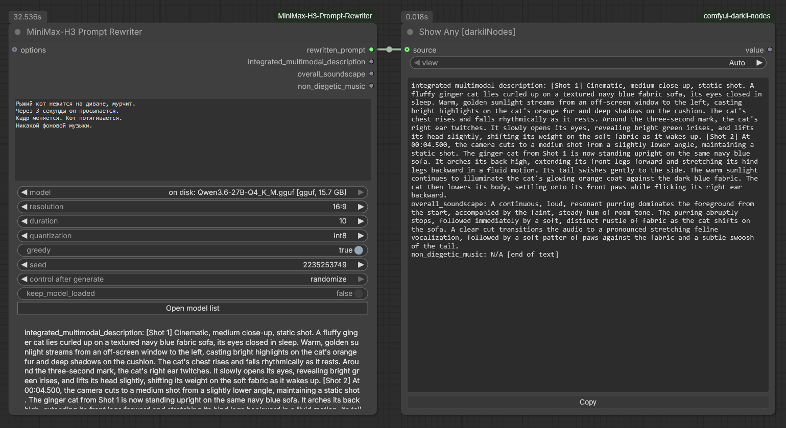
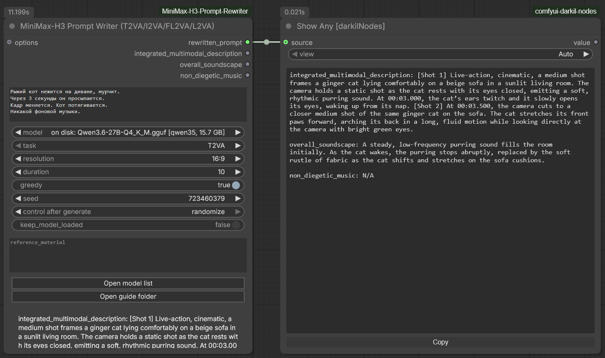

# MiniMax-H3 Prompt Rewriter for ComfyUI

ComfyUI nodes for the [LightX2V MiniMax-H3 T2VA Prompt Rewriter LoRA](https://huggingface.co/lightx2v/MiniMax-H3-Prompt-Rewriter-LoRA).
A short prompt goes in; a structured, production-ready audio-video description
for [MiniMax-H3](https://huggingface.co/MiniMaxAI/MiniMax-H3) comes out — entirely locally.

[Русская версия](README_RU.md)



The prompt may be in any language the base model reads; the rewrite comes back in
English, which is what MiniMax-H3 expects.

```text
"A red fox walks through a snowy forest at dawn."  +  16:9  +  15s
                              │
                              ▼
              Qwen3.6-27B + Prompt Rewriter LoRA
                              │
                              ▼
   integrated_multimodal_description: [Shot 1] ... [Shot 2] 0:06 ...
   overall_soundscape: ...
   non_diegetic_music: ...
                              │
                              ▼
              MiniMax-H3 video + synchronized audio
```

There are two ways to get that output, and the pack ships both:

| | Rewriter node | Writer nodes |
|---|---|---|
| Where the format comes from | the LoRA — a 27B trained until H3 output came out of it unprompted | MiniMax's own writing guide, in the system prompt |
| Model | Qwen3.6-27B only | any instruction-following GGUF |
| Smallest working setup | ~10 GB download, ~13 GB VRAM | **2.6 GB download, ~5 GB VRAM** |
| Tasks | T2VA | T2VA, I2VA, FL2VA, L2VA, Ref2VA |
| Quality | the reference | close, and it runs on hardware the LoRA cannot touch |

Both read text. A third node, [Reference Caption](#minimax-h3-reference-caption),
turns an image, an audio clip or a video into the text they need — 3 to 5 seconds
per asset on a 3.4 GB model.

If your card has 8 GB, skip to [the writer nodes](#minimax-h3-prompt-writer-t2vai2vafl2val2va).

## What you need before installing

The LoRA route is a 27-billion-parameter language model, not a small helper.
There is no way around the following, because the adapter is bound to one
specific base model. **The writer nodes have none of these requirements** — see
their table below.

| Resource | Requirement |
|---|---|
| Disk | **~52 GB** for `Qwen/Qwen3.6-27B` + **~3.5 GB** for the adapter — or **~10–16 GB** total on the GGUF route |
| VRAM (`nf4`, default) | **~16 GB** |
| VRAM (`int8`) | ~28 GB |
| VRAM (`bfloat16`) | ~54 GB, spills into system RAM via accelerate |
| VRAM (GGUF) | ~13–19 GB depending on the quant, lower still with fewer offloaded layers |
| Packages | `transformers`, `peft`, `accelerate`, and `bitsandbytes` for `nf4`/`int8`; `llama-cpp-python` for GGUF |

> **The MiniMax-H3 text encoder cannot be reused for this.** It is a different
> model (Qwen3-VL-32B, vocabulary 151936) from the LoRA's base (Qwen3.6-27B,
> vocabulary 248320); it contains none of the linear-attention `in_proj_*`
> modules the adapter targets; it is truncated to the first 50 of 64 layers; and
> it ships without `lm_head` or a final norm, so it cannot generate text at all.
> It only produces hidden states for the DiT.

## Install

Clone into `ComfyUI/custom_nodes/` and install the requirements into the same
Python environment ComfyUI runs on:

```bash
cd ComfyUI/custom_nodes
git clone https://github.com/pytraveler/MiniMax-H3-Prompt-Rewriter-ComfyUI
```

For ComfyUI portable on Windows:

```bat
python_embeded\python.exe -m pip install -r ComfyUI\custom_nodes\MiniMax-H3-Prompt-Rewriter-ComfyUI\requirements.txt
```

Or install it from the Comfy registry through ComfyUI-Manager.

## Nodes

### MiniMax-H3 Prompt Rewriter

The main node. It downloads whatever is missing, loads the model, generates, and
releases the VRAM again.

**Outputs**

| Name | Contents |
|---|---|
| `rewritten_prompt` | The full rewrite, ready to paste into a MiniMax-H3 text input |
| `integrated_multimodal_description` | Just the shot-by-shot visual section |
| `overall_soundscape` | Just the diegetic audio section |
| `non_diegetic_music` | Just the score section |

**Inputs**

- `prompt` — the short prompt to expand.
- `model` — the base model. The list holds every entry from your model list plus
  every Qwen3.6-27B already on disk (prefixed `on disk:`). Anything not present
  is downloaded on first use, resuming if interrupted. The **Open model list**
  button edits the list — see below.
- `resolution` / `duration` — conditions the rewrite is composed for. Keep them
  equal to what you pass to MiniMax-H3, or the shot pacing will not match.
- `quantization` — how to load an *unquantized* checkpoint: `nf4` (default,
  ~16 GB VRAM), `int8` (~28 GB), `bfloat16` / `float16` (~54 GB). Ignored when
  the checkpoint brings its own quantization.
- `greedy` — on by default for deterministic output. Turn it off to sample.
- `seed`
- `keep_model_loaded` — **off by default.** The 27B model is released as soon as
  the rewrite finishes, so the same GPU can run H3 video generation next. Turn it
  on only when iterating on prompts back-to-back.
- `options` — optional; connect a **MiniMax-H3 Rewriter Options** node.

### MiniMax-H3 Rewriter Options

Everything you rarely touch, kept off the main node. Leave it unconnected and the
rewriter uses the decoding parameters the adapter was published with.


| Input | Default | Purpose |
|---|---|---|
| `max_new_tokens` | 2048 | Generation cap |
| `temperature` / `top_p` / `top_k` | 0.7 / 0.8 / 20 | Sampling, used only when `greedy` is off |
| `repetition_penalty` | 1.05 | |
| `attn_implementation` | `sdpa` | `eager` or `flash_attention_2` if you have it |
| `adapter` | the LightX2V repo | Repository id or local folder of the LoRA |
| `use_lora` | on | Turn off for the plain Qwen3.6-27B baseline |
| `auto_download` | on | Turn off to fail loudly instead of fetching 52 GB |
| `device` | `auto` | Which GPU runs the language model — see below |

The same options node feeds the writer nodes and the captioner; `adapter` and
`use_lora` simply do not apply there.

#### `device` — and why it changes `keep_model_loaded`

Every node here has carried the same warning: turn `keep_model_loaded` off,
because the card is needed for video generation the moment the rewrite finishes.
That warning exists only because both models want the same device. **With two
cards they need not.**

Values are `auto`, `cpu`, and one `cuda:N` per GPU ComfyUI can see. One spelling,
three backends:

| | `auto` | `cuda:1` | `cpu` |
|---|---|---|---|
| llama.cpp binaries | unchanged | `--device CUDA1` | `--device none`, 0 layers |
| llama-cpp-python | unchanged | `main_gpu=1`, split mode `NONE` | `n_gpu_layers=0` |
| Transformers | `device_map="auto"` | `device_map={"": "cuda:1"}` | `{"": "cpu"}` |

The important part is not the placement. **On another card, ComfyUI's own models
are no longer evicted first.** Every backend here unloads them unconditionally
today, which is right when both want the same VRAM and pure waste when they do
not — it costs a full reload of the diffusion model after every rewrite. Pick a
second card and the rewriter loads beside it, `keep_model_loaded` becomes worth
switching on, and nothing has to move.

Two details worth knowing. A device the machine does not have is **refused, not
quietly demoted** — a workflow carried over from a two-card machine says so,
instead of running on the wrong card and evicting a batch mid-flight. And the
numbering is ComfyUI's own: started with `--cuda-device 1`, ComfyUI sees exactly
one device and it is `cuda:0`, for the subprocesses too.

The values are deliberately plain rather than `cuda:1 · RTX 4090`: a label with
the card's name reads better and breaks every saved workflow the day the card is
replaced. The tooltip names what is in each slot.

### MiniMax-H3 Prompt Writer (T2VA/I2VA/FL2VA/L2VA)

The same three output fields, without the LoRA and without the 27B. MiniMax's own
[prompt-writing guide](https://huggingface.co/MiniMaxAI/MiniMax-H3/blob/main/docs/VIDEO_PROMPT_WRITING_GUIDE_base_en.md)
goes into the system prompt and any instruction-following GGUF writes to it. A
5.2 GB Qwen3.5-9B fills all three fields, with correct camera vocabulary, speaker
IDs and `<d>[English] …</d>` dialogue, in about 20 seconds.



*T2VA, 10 seconds at 16:9, on a local Qwen3.6-27B — 11.2 s. The prompt went in
in Russian and the description came back in H3's English format, with the cut at
00:03.000 that the prompt asked for and `non_diegetic_music: N/A` because it
asked for no music.*

The trade is worth stating plainly. The LoRA **is** the format: a 27B was trained
until H3 output came out of it with a seven-line system prompt. Here the format is
carried by ~4 000 tokens of instructions the model has to follow, so expect the
LoRA's prose to be denser and its formatting more reliable. Expect this to run at
all on hardware the LoRA cannot touch.

Outputs are identical to the rewriter node's — same names, same order — so the two
are interchangeable in a saved workflow.

Beyond the rewriter's inputs:

- `task` — **T2VA**, **I2VA**, **FL2VA** or **L2VA**. Everything but T2VA also
  emits the alignment instruction line H3 requires as the very first line, with
  the duration already substituted to two decimals; only the final shot number is
  left to the model.
- `reference_material` — **this node reads text, not pixels.** For I2VA, FL2VA and
  L2VA, describe what the reference frames show, by hand or from the
  [Reference Caption](#minimax-h3-reference-caption) node upstream. Without it the
  model invents a first frame that has nothing to do with your image.

`model` offers the `writers` section of the model list plus every GGUF already in
your ComfyUI model folders, whatever its architecture. Nothing here has to be
Qwen3.6-27B, and nothing has to be installed: without `llama-cpp-python` the node
runs the official llama.cpp binaries, exactly as the GGUF route below does.

| Suggested writer | Download | VRAM with the guide in context |
|---|---|---|
| Qwen3.5-4B `Q4_K_M` | 2.6 GB | ~5 GB — start here on an 8 GB card |
| Qwen3.5-9B `Q4_K_M` | 5.3 GB | ~8 GB — best writing per gigabyte |
| Qwen3.5-9B Uncensored (HauhauCS) `Q4_K_M` | 5.2 GB | ~8 GB — does not decline scenes the stock model refuses |
| Gemma 3 12B Instruct `Q4_K_M` | 6.8 GB | ~10 GB — non-Qwen alternative |
| Mistral Small 3.2 24B Instruct `Q4_K_M` | 13.4 GB | ~17 GB — for 16 GB cards and up |

`n_ctx` is raised automatically: the base guide needs about 9 200 tokens of
context and the full-reference guide about 12 300, against the 8 192 default that
suits the LoRA's short system prompt. Letting llama.cpp truncate instead would
drop the *front* of the prompt — the guide and the output contract — and the
answer would come back in some other format with nothing to say why.

If a field comes back missing, the node still returns everything it got and says
which fields are absent, on the node. Lower the temperature or move up a size.

### MiniMax-H3 Prompt Writer (Ref2VA)

Full-reference mode, from MiniMax's
[full-reference guide](https://huggingface.co/MiniMaxAI/MiniMax-H3/blob/main/docs/VIDEO_PROMPT_WRITING_GUIDE_ref_en.md).
Six sections instead of three, each its own output:

| Output | Contents |
|---|---|
| `subject_definitions` | what each `<Subject N>` / `<Picture N>` / `<Video N>` / `<Audio N>` label denotes |
| `summary` | the `[task type]` prefix and the reference relationships in one paragraph |
| `retention_analysis` | per label: `fully_preserved`, `partially_preserved`, `attribute_transfer`, `weak_reference`, `fully_copy`, … |
| `detailed_description` | the body, shot by shot, with labels cited where their roles apply |
| `overall_soundscape` | ambience and physical sound |
| `non_diegetic_music` | audience-only score |


*The same clip as above with one `Picture 1:` line added to `reference_assets` —
17.4 s. The model picked the task type, bound `<Subject 1>` to the cat and
`<Picture 1>` to the drawing's style, and wrote the retention analysis itself.*

`reference_assets` is **required** and is refused when empty: full-reference mode
describes how a target video reuses assets, so with no assets it is simply T2VA
under another name. One per line —

```text
Picture 1: young woman, long dark hair, blue cardigan, thin silver necklace
Picture 2: corner cafe interior, brick wall, brass lamps, rain on the window
Audio 1: voice-timbre reference for the woman — low, unhurried, slight rasp
```

— and the model binds the labels, picks the task type, and writes the retention
analysis from them. Or let
[MiniMax-H3 Reference Caption](#minimax-h3-reference-caption) write those lines
for you from the assets themselves.

### MiniMax-H3 Reference Caption

The writer nodes read text, not pixels. This is where the text comes from:
connect an image, an audio clip or a video, and a small multimodal model
describes it into one labelled line of `reference_assets`.

Measured on a 3.4 GB Qwen2.5-Omni-3B: **3 s for a frame, 2 s for an audio clip,
5 s for a video.** It runs through the same llama.cpp binaries as everything else
— `llama-mtmd-cli` ships in the archive the rewriter already fetches, so a
machine that has run one rewrite downloads no runtime at all.

**Chain them by wiring** `reference_assets` into the next node's `previous`. Each
label is numbered *within its own category*, which is the guide's own rule
(«`<Video N>` and `<Audio N>` are numbered independently»), so four assets come
out as `Picture 1`, `Picture 2`, `Video 1`, `Audio 1` — not 1 through 4.


*An image and an audio clip through Qwen2.5-Omni-7B — 4.4 s and 3.7 s. The
second node received the first one's block on `previous` and appended to it, and
the `Audio` role described the voice rather than transcribing it: "a male
speaker with a calm and measured delivery, speaking in Russian".*

`role` picks both the label and the question asked, and the questions differ on
purpose:

| `role` | What the model is asked for |
|---|---|
| `Subject` | the features that must stay consistent across shots — build, hair, clothing and their colours, carried objects |
| `Picture` | the frame as a shot — style, shot size, camera angle, placement, environment, lighting |
| `Video` | subjects, actions in order, camera movement, cuts and pacing |
| `Audio` | **the sound, not the words** — voice timbre, apparent age and gender, delivery and rate, instrumentation, tempo, ambience |

That last row is the one that matters. `<Audio N>` in the guide is usually a
*timbre* reference, and a transcript throws away exactly the part that is needed,
so the instruction says "do not transcribe" outright. If you also want the spoken
words verbatim for a `<d>` block, that is an ASR job — run Whisper alongside and
paste the line in.

Other inputs:

- `description` — type it yourself and **no model runs at all**. The fastest way
  to add an asset you can describe in six words.
- `instruction` — override the role's question entirely.
- `max_frames` — how many frames to take from an IMAGE batch **or a VIDEO**,
  spread evenly. All of them would overflow both the context and the wall clock:
  two seconds at 25 fps is 56 images through the vision tower, and thirty seconds
  is 750. This is what makes the cost of describing a clip independent of its
  length.
- `context_size` — `0` means the model's own, which is what its projector was
  sized against; one 1024×1024 frame is already twenty-odd media chunks. Lower it
  only to cut the KV cache, and know that too small a value fails the run instead
  of truncating it.

> **Not every multimodal GGUF works here**, and the ones that do not fail loudly.
> llama.cpp's `mtmd` has to understand the projector format: Gemma 4's aborts the
> process outright on `b10310` — with Google's own file and with unsloth's alike,
> on the CUDA and CPU builds alike — while `llama-completion` runs the same model
> as text with no trouble. So the `captioners` list holds only pairs that have
> actually been run:
>
> | Captioner | Download | Modalities |
> |---|---|---|
> | Qwen2.5-Omni-3B `Q4_K_M` + mmproj | 3.4 GB | image, audio, video |
> | Qwen2.5-Omni-7B `Q4_K_M` + mmproj | 5.8 GB | image, audio, video |
>
> A model and its `mmproj` sitting together in one folder under `models/LLM` is
> offered automatically, so you can try another without editing anything.

### MiniMax-H3 Guide Prompt (any LLM)

Builds the guide-based `system_prompt` and `user_prompt` and returns them as
strings, without running anything. Costs no VRAM and no time. Wire them into
whichever LLM node you already use — local, API, remote — when you would rather
not run the model here. It covers all five tasks, Ref2VA included.

### The guides are fetched, not bundled

The two guides are not shipped inside this pack. They are MiniMax's
Documentation, and the MiniMax H3 Community License grants the right to
redistribute the Materials only within its "Applicable Territory" — worldwide
*excluding* the European Union, the United Kingdom, the Republic of Korea and the
United States — and only alongside a copy of the agreement and a NOTICE file. A
node pack on a registry cannot honour a territory boundary, so each installation
fetches its own copy directly from MiniMax on first use: 16 KB and 24 KB, once,
under the same `auto_download` switch as everything else.

They land in

```text
ComfyUI/user/minimax_h3_rewriter/guides/
```

which the **Open guide folder** button opens. Editing a copy changes the system
prompt, and a fetch never overwrites a file that is already there — trimming the
guide is the cheapest way to fit a small model's context.

### The model list

The **Open model list** button on the rewriter node opens

```text
ComfyUI/user/minimax_h3_rewriter/models.json
```

in your desktop's JSON editor — on the machine running ComfyUI, which is not
necessarily the one looking at the browser tab. It is seeded from the packaged
copy on first use, so updating the node pack never overwrites your edits.

It holds three lists with the same fields. **`models`** feeds the LoRA rewriter
and has to be Qwen3.6-27B:

```json
{
  "name": "Qwen3.6-27B FP8",
  "repo": "Qwen/Qwen3.6-27B-FP8",
  "download_gb": 28.8,
  "vram": "~29 GB, no extra package needed"
}
```

**`writers`** feeds the writer nodes and can be anything, as long as it is a GGUF
language model with a chat template:

```json
{
  "name": "Qwen3.5-4B",
  "repo": "unsloth/Qwen3.5-4B-GGUF",
  "file": "Qwen3.5-4B-Q4_K_M.gguf",
  "format": "gguf",
  "download_gb": 2.6,
  "vram": "~5 GB with the guide in context"
}
```

**`captioners`** feeds the reference caption node and needs one extra field,
`mmproj` — a multimodal model is two files and both come from the same
conversion:

```json
{
  "name": "Qwen2.5-Omni-3B",
  "repo": "ggml-org/Qwen2.5-Omni-3B-GGUF",
  "file": "Qwen2.5-Omni-3B-Q4_K_M.gguf",
  "mmproj": "mmproj-Qwen2.5-Omni-3B-Q8_0.gguf",
  "format": "gguf",
  "download_gb": 3.4
}
```

`repo` may equally be an absolute path to a folder you already have. Add an entry,
refresh the browser, and it is in the dropdown. Keep `name` stable — saved
workflows remember the label, and a node whose stored choice has vanished says so
by name instead of silently picking something else.

#### Updates add new entries without touching yours

Your copy is never overwritten, but models added to the pack after you installed
**are merged in** — otherwise "we will not touch your list" quietly becomes "you
will never see anything new", with nothing anywhere to say the node knew about
more.

The rule is set algebra, not a version check. Beside the lists your file records
`seed_offered`: every name the packaged list has ever put in front of this
installation. An update then adds

```text
names in the pack  −  names in your file  −  names you were already offered
```

so an entry you deleted stays deleted, one you renamed is not duplicated, and a
genuinely new one arrives. Deleting a name from `seed_offered` offers that entry
again on the next start.

One exception, once: a file written before this existed has no record of what it
was offered, so on the first update everything missing comes back — including
anything you had deleted by hand. The previous file is kept beside it as
`models.json.bak`, and from then on your deletions stick.

Merges are logged to the ComfyUI console by name. A file the node cannot parse is
left exactly as it is and the packaged list is used for that session, so a stray
comma costs you a restart, not your edits.

## Where the weights go

```text
ComfyUI/models/LLM/
├── Qwen3.6-27B/                          # base model, ~52 GB
├── MiniMax-H3-Prompt-Rewriter-LoRA/      # adapter, ~3.5 GB
├── Qwen3.5-9B-Q4_K_M.gguf                # a writer model, one file
└── Qwen2.5-Omni-3B/                      # a captioner: model + mmproj together

ComfyUI/user/minimax_h3_rewriter/
├── models.json                           # your model list
├── guides/                               # the two writing guides, 40 KB
└── runtime/                              # llama.cpp binaries, if fetched
```

**Already downloaded the LoRA?** Point the `adapter` widget at that folder
directly (an absolute path is accepted) and nothing is fetched again.

## Using a model you already have

52 GB is a lot to ask, so the node looks for the base model before offering to
download it. The `model` dropdown lists every Qwen3.6-27B found in

- all directories ComfyUI registers for `LLM`, `transformers` and `diffusers`
  — including anything mapped in through `extra_model_paths.yaml`, and
- the Hugging Face cache (`HF_HOME` / `HF_HUB_CACHE` / `~/.cache/huggingface/hub`),

so a copy pulled earlier by any other tool is reused instead of downloaded twice.
Only directories whose weights are actually present are listed; a cache entry
holding nothing but `config.json` is not offered.

### Smaller repackings

Any repository you put in the model list is checked from a 4 KB `config.json`
**before** a single weight moves. Every repacking keeps
the same fingerprint (`model_type qwen3_5`, hidden 5120, 64 layers, vocab 248320),
so what actually decides the outcome is the quantization runtime:

| Build | Download | Runtime package | LoRA attaches? | Verdict |
|---|---|---|---|---|
| `quant_method: bitsandbytes` (nf4 repack) | **~17 GB** | `bitsandbytes`, already required | yes | **works as shipped — the low-resource route** |
| `Qwen/Qwen3.6-27B` (bf16) | 52 GB | none; `bitsandbytes` for `nf4`/`int8` | yes | **works as shipped** |
| `Qwen/Qwen3.6-27B-FP8` | 29 GB | `kernels`, plus a kernel fetched from the Hub | yes | advanced only; needs >29 GB of VRAM |
| `quant_method: awq` | ~19 GB | `autoawq` | yes | works after installing it |
| `quant_method: gptq` | ~19 GB | `gptqmodel` | yes | works after installing it |
| `quant_method: compressed-tensors` | ~19 GB | `compressed-tensors` | **no** | not supported |
| `quant_method: modelopt` (NVFP4) | ~20 GB | `nvidia-modelopt` | **no** | not supported |

PEFT ships LoRA dispatchers for bitsandbytes, AWQ, GPTQ, HQQ, EETQ, AQLM and
torchao layers, and plain `nn.Linear` covers bf16/fp16 and FP8. For
compressed-tensors and modelopt there is no dispatcher, so the adapter cannot be
attached at all — no package will fix that.

> A repository's **name** is not its format: `cyankiwi/Qwen3.6-27B-AWQ-INT4` and
> `unsloth/Qwen3.6-27B-NVFP4` are both `compressed-tensors`, so neither can take
> the LoRA. The node reports the real `quant_method` and the exact reason before
> downloading anything.

### If the node says a package is missing

Nothing in the recommended routes needs one. bf16, the nf4 repacks and the
`nf4`/`int8` options all run on packages this pack already declares, so a
missing-package message only appears for a build you went looking for.

When it does appear it names the package **and the command for the interpreter
that is actually running ComfyUI** — `pip install kernels` typed into an
ordinary terminal installs into whichever Python is on PATH, which on a portable
install is never the right one, and the node goes on refusing:

```
This base model cannot run the prompt-rewriter LoRA.
  - the 'fp8' checkpoint needs the 'kernels' package, which is not installed in
    this Python environment. Install it with:
      "…\python_embeded\python.exe" -m pip install kernels
    Note: installing it is only half of it: the FP8 matmul is a Triton kernel
    that transformers then downloads from 'kernels-community/finegrained-fp8'
    on the first generation, and that needs a build matching this torch and
    CUDA version.
```

Run the line as printed and restart ComfyUI. The pack installs nothing into your
environment on its own, and never will: a node that silently pip-installs is a
node that can break an unrelated part of ComfyUI while you watch a progress bar.

## Smallest download without any extra install

A `bitsandbytes` nf4 repack of Qwen3.6-27B is **~17 GB to download and ~16 GB of
VRAM**, and it needs nothing this node does not already require. That is the
route to point people at: same code path as the official checkpoint, no new
dependency, a third of the download.

Those repacks are third-party — the node verifies the architecture from
`config.json` before fetching anything, which proves the shape is right, not that
the uploader is trustworthy. Judge that yourself, or make your own repack once
from the official weights.

## GGUF — smaller still, and nothing to install

Pick a `[gguf]` entry from the model list and the rewriter runs under llama.cpp
instead of Transformers. **No pip install is involved.** If `llama-cpp-python`
happens to be in ComfyUI's environment the node uses it; if it is not, the node
fetches the official llama.cpp binaries (~34 MB) into
`ComfyUI/user/minimax_h3_rewriter/runtime/` and runs `llama-cli` as a
subprocess. Same download switch as the weights: `auto_download`.

The subprocess reloads the model on every run, which costs nothing in practice —
the node's default is `keep_model_loaded = False`, because the card is needed
for video generation the moment the rewrite finishes, and the in-process backend
already unloads after every run too. What the binary backend genuinely cannot do
is honour `keep_model_loaded = True`. Two things come free with it: VRAM is
returned by the operating system rather than by a deallocator, and a llama.cpp
crash takes down a child process instead of ComfyUI and its queue.

Two options in the options node control this, and they answer different
questions. **`gguf_runtime`** picks *what runs the model*:

| `gguf_runtime` | Meaning |
|---|---|
| `auto` | llama-cpp-python if it is importable, the binaries otherwise |
| `llama-cpp-python` | force the wheel; fails with a clear message if it is absent, rather than quietly using something else |
| `llama.cpp` | force the binaries, even when a wheel is installed — the way out when the installed wheel is broken |

Only `llama-cpp-python` can honour `keep_model_loaded`; the binaries hand the
model back to the operating system when the subprocess exits.

**`llama_backend`** then picks *which official build to fetch*, and applies only
when the binaries are in use:

| `llama_backend` | Download | Notes |
|---|---|---|
| `auto` → `vulkan` | 34 MB | NVIDIA, AMD and Intel alike; about half the CUDA throughput |
| `cuda` | 511 MB | ~2× faster on NVIDIA; **Windows only** — upstream publishes no Linux CUDA build |
| `cpu` | 17 MB | no GPU at all |

> **Why not the `llama-cpp-python` CUDA wheels.** Both current ones fail on
> ordinary consumer hardware, in two unrelated ways:
>
> | Wheel | Build flags | What happens |
> |---|---|---|
> | `v0.3.34-cu130` | `AVX512 = 1`, `ARCHS = 750..900` | weights load, then `llama_init_from_model` dies with `0xC000001D` — no consumer Intel 12th–14th gen chip has AVX-512 |
> | `v0.3.34-cu132` | `AVX512 = 0`, `ARCHS = 750..900` | reaches the first kernel, then `the provided PTX was compiled with an unsupported toolchain` — no `sm_120` in the list, so an RTX 50-series card falls back to JIT, which a driver older than the build's toolkit refuses |
> | `v0.3.34-vulkan` | `AVX512 = 0`, no arch list | works, and picks up `NV_coopmat2` where the driver offers it |
>
> The official release archives have neither problem. They carry **14** CPU
> backend variants and choose one at run time, which is why the same model runs
> fine under `llama-cli` on the machine where the cu130 wheel dies. And their
> CUDA archive carries native SASS with no PTX at all —
> `cuobjdump --list-elf` reports `sm_86 sm_89 sm_120a sm_121a` — so the driver
> is never asked to compile anything.
>
> If you want the in-process backend anyway, the Vulkan wheel is the one that
> works: `pip install https://github.com/abetlen/llama-cpp-python/releases/download/v0.3.34-vulkan/llama_cpp_python-0.3.34-py3-none-win_amd64.whl`

| Base quant | Download | VRAM with the adapter |
|---|---|---|
| `Q4_K_M` | 15.7 GB | ~19 GB |
| `IQ4_XS` | 14.4 GB | ~18 GB |
| `UD-Q3_K_XL` | 13.5 GB | ~17 GB |
| `UD-IQ2_M` | 10.1 GB | ~13 GB, noticeably lower fidelity |

Lower `gpu_layers` in the options node to fit a smaller card, at the cost of
speed. With `Q4_K_M` fully offloaded to a high-end consumer NVIDIA card, CUDA
generates at roughly **50 tok/s** with the adapter against 78 tok/s without it —
that ~35% is llama.cpp doing the adapter's matmuls — and Vulkan at roughly half
the CUDA figure.

> **A smaller Qwen3.5 is not a substitute.** Qwen3.5-9B carries the same
> `general.architecture = qwen35` in its header, so it looks like a match and
> the model list will show it — but it has 32 blocks of width 4096 where the
> adapter needs 64 of 5120. llama.cpp refuses to attach the LoRA
> (`tensor 'blk.0.attn_gate.weight' has incorrect shape`) and the run fails.
> The node checks those two header numbers first and says so before anything is
> downloaded, and labels such files `(wrong size for the adapter)` in the
> dropdown. If you see a 9B producing a plausible-looking rewrite, it is running
> **without** the adapter: the format comes from the system prompt, not from the
> LoRA. That is not a dead end — it is precisely what the
> [writer nodes](#minimax-h3-prompt-writer-t2vai2vafl2val2va) do on purpose, with
> the full guide in the prompt instead of seven lines.

The GGUF route uses a **converted** adapter, not the PEFT one. Point the options
node's `adapter` at a local `.gguf`, or set `adapters.gguf.repo` in the model
list. The prompt is built from the GGUF's own chat template with
`enable_thinking=False`, and the result is byte-identical to what
`transformers.apply_chat_template` produces — the model sees exactly the text the
LoRA was trained on.

When the checkpoint carries its own quantization, the `quantization` widget is
ignored — bitsandbytes is not stacked on top of AWQ or FP8.

### Progress on the node

Downloads, weight loading, and token generation all report onto the node itself
through ComfyUI's own progress channels — a bar plus a caption with the current
file, transferred size, speed and ETA. No custom frontend extension is involved,
so nothing breaks when the ComfyUI frontend updates.

### Environment variables

| Variable | Effect |
|---|---|
| `HF_TOKEN` | Access token for gated or private repositories |
| `HF_ENDPOINT` | Mirror to download from instead of `huggingface.co` |

## Notes

- **Speed.** Qwen3.6-27B is a hybrid model: 48 of its 64 layers use linear
  attention. Without `flash-linear-attention` and `causal-conv1d` installed,
  Transformers falls back to a slower pure-PyTorch path and says so in the
  console. The fallback is correct, just slower; both packages are optional and
  awkward to build on Windows.
- **Determinism.** With `greedy` on, the same prompt, resolution, duration and
  seed produce the same rewrite, and ComfyUI caches the node accordingly.
- **Interruption.** Cancelling a run stops both a download and a generation in
  progress; a partial download resumes on the next run.
- **Format on the writer nodes is followed, not guaranteed.** A general model is
  obeying instructions rather than reproducing a distribution it was trained on.
  Keep `greedy` on — small models drift out of the format as soon as they sample —
  and if a field is missing the node returns everything it did get and names the
  gap on the node rather than failing.
- **A chat template that rejects a system role still works.** Gemma's calls
  `raise_exception` on one; the guide is then folded into the first user turn, as
  those models' own cards prescribe.
- **Listing your GGUF models is nearly free.** Building the dropdown needs six
  values from the first few kilobytes of each file, but `gguf.GGUFReader`
  materialises the whole header the moment it opens one — including
  `tokenizer.ggml.tokens`, a quarter of a million strings. Ten files in a model
  folder cost 31 seconds, paid the first time ComfyUI answered `/object_info`.
  The header is now walked directly and skipped past, which is the same six
  values in **0.4 s**. A half-downloaded file is still refused, by checking its
  tensor offsets against its size rather than by failing to map them.
- **The captioner writes media to a temporary folder** — an IMAGE and a VIDEO
  become PNGs, an AUDIO a 16-bit WAV written with the standard library — and
  removes the folder afterwards, including when the child process crashes.
- **A VIDEO is sampled here, not passed to `llama-mtmd-cli --video`.** That flag
  feeds the file to `ffprobe` through *stdin*, and when the MP4 carries its `moov`
  atom at the front — which is what "faststart" means, and what ComfyUI, phones
  and most of the web produce — ffprobe has what it needs after a few kilobytes
  and exits without reading the rest. llama.cpp is still writing the remaining
  megabytes into that pipe and blocks there for good: no output, no error, no end.
  Same clip with `moov` moved to the end runs in six seconds. Frames are decoded
  in-process instead, which also makes `max_frames` mean something for a VIDEO.
- The rewrite may add details a short prompt never stated. Review it before
  generating when identity, dialogue, timing or composition must be exact.

## Credits

The model work is entirely [LightX2V](https://github.com/ModelTC/LightX2V)'s —
this repository only wires their adapter into ComfyUI. If you find it useful,
star **[ModelTC/LightX2V](https://github.com/ModelTC/LightX2V)**, where the
MiniMax-H3 inference support and future rewriter tasks (FL2VA, Ref2VA) are
maintained.

| Component | Source |
|---|---|
| LoRA adapter | [lightx2v/MiniMax-H3-Prompt-Rewriter-LoRA](https://huggingface.co/lightx2v/MiniMax-H3-Prompt-Rewriter-LoRA) |
| Base language model | [Qwen/Qwen3.6-27B](https://huggingface.co/Qwen/Qwen3.6-27B) |
| Video/audio generator | [MiniMaxAI/MiniMax-H3](https://huggingface.co/MiniMaxAI/MiniMax-H3) |
| Prompt-writing guides | [MiniMaxAI/MiniMax-H3 `docs/`](https://huggingface.co/MiniMaxAI/MiniMax-H3/tree/main/docs) — fetched at run time, see above |
| Inference framework | [ModelTC/LightX2V](https://github.com/ModelTC/LightX2V) |

The prompt template in `minimax_h3_rewriter/prompt_template.py` is reproduced
byte-for-byte from the adapter repository; changing it degrades the rewrite.

Use of MiniMax-H3 is governed by the licence and acceptable-use terms in the
[official MiniMax-H3 repository](https://huggingface.co/MiniMaxAI/MiniMax-H3).

## Licence

MIT — see [LICENSE](LICENSE). This covers the ComfyUI integration code only; the
model weights carry their own licences.
